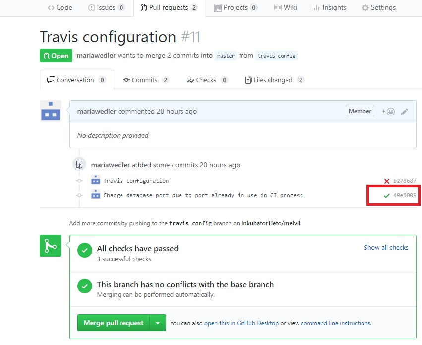
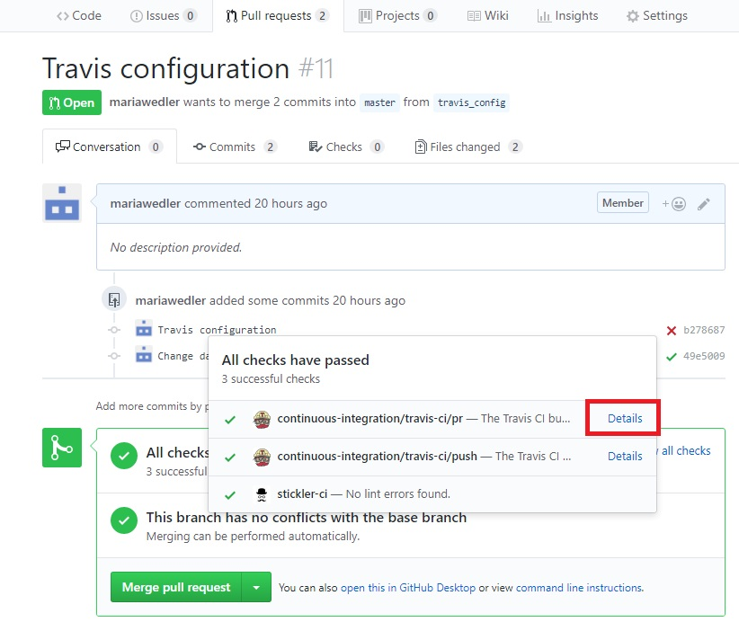
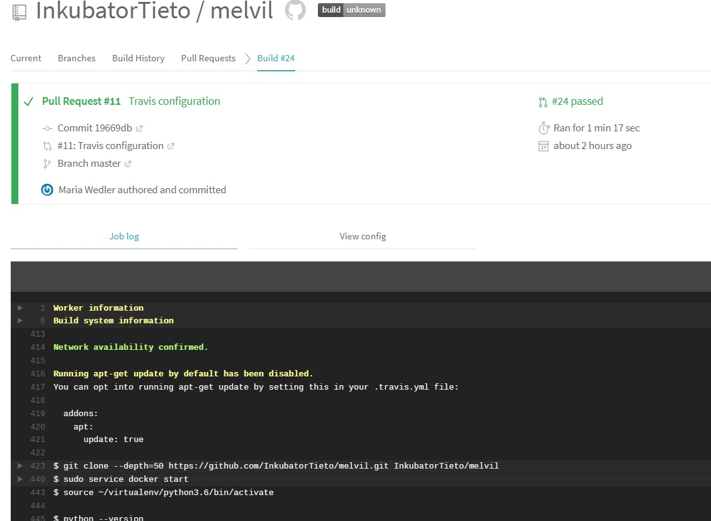

## Travis CI :
Travis CI is continuous integration service used to build and test software projects hosted at GitHub.
Our Travis is configured to only run for branches which name don�t star with �wip�.
Travis is checking out the relevant branch and run the commands specified in .travis.yml, which usually build the software and run any automated tests. When that process has completed, Travis CI send an email containing the test results (showing success or failure).

How to use it:
1. go to the tab with yours Pull requests,
2. now you can see if all your checks have passed 
3. for more information- expand the functions marked in the red rectangle:

4. If you want to know more details of your checks:

5. Here you can find more information about the test:
